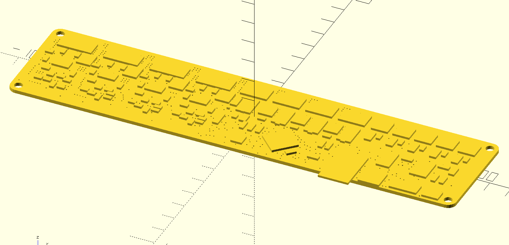

# Zonestar Melzi Case

This case is designed to house the Melzi v2 board.

## Motivation

This printer is inexpensive and generally well built but the frame is too thin and flexes too much. These parts are designed to assist with adding rigidity and holding the frame in alignment.

### Melzi PCB

This repository also contains a model for the Melzi v2 PCB in STL format. It is useful for making a case with the right openings for the various cables and ports.

## Parts Required

- 4x M2x8 bolts for securing lid.
- 4x M3x8 bolts for mounting PCB.
- 4x M3x8 bolts for mounting to steel frame.
- 60mm 25mm fan for ventilation.
- Fan dust cover and fan grill for top and bottom vents respectively.

## Instructions

### Melzi Case

Print out the top and bottom separately, along with the reset button.

## Contributing

1. Fork it
2. Create your feature branch (`git checkout -b my-new-feature`)
3. Commit your changes (`git commit -am 'Add some feature'`)
4. Push to the branch (`git push origin my-new-feature`)
5. Create new Pull Request

## License

Released under the MIT license.

Copyright, 2016, by [Samuel G. D. Williams](http://www.codeotaku.com/samuel-williams).

Permission is hereby granted, free of charge, to any person obtaining a copy
of this software and associated documentation files (the "Software"), to deal
in the Software without restriction, including without limitation the rights
to use, copy, modify, merge, publish, distribute, sublicense, and/or sell
copies of the Software, and to permit persons to whom the Software is
furnished to do so, subject to the following conditions:

The above copyright notice and this permission notice shall be included in
all copies or substantial portions of the Software.

THE SOFTWARE IS PROVIDED "AS IS", WITHOUT WARRANTY OF ANY KIND, EXPRESS OR
IMPLIED, INCLUDING BUT NOT LIMITED TO THE WARRANTIES OF MERCHANTABILITY,
FITNESS FOR A PARTICULAR PURPOSE AND NONINFRINGEMENT. IN NO EVENT SHALL THE
AUTHORS OR COPYRIGHT HOLDERS BE LIABLE FOR ANY CLAIM, DAMAGES OR OTHER
LIABILITY, WHETHER IN AN ACTION OF CONTRACT, TORT OR OTHERWISE, ARISING FROM,
OUT OF OR IN CONNECTION WITH THE SOFTWARE OR THE USE OR OTHER DEALINGS IN
THE SOFTWARE.